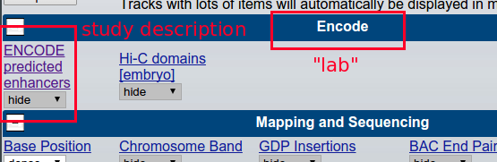
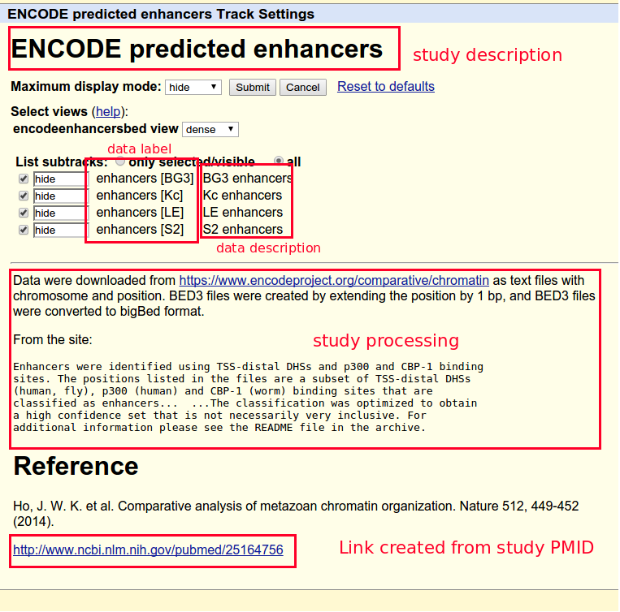
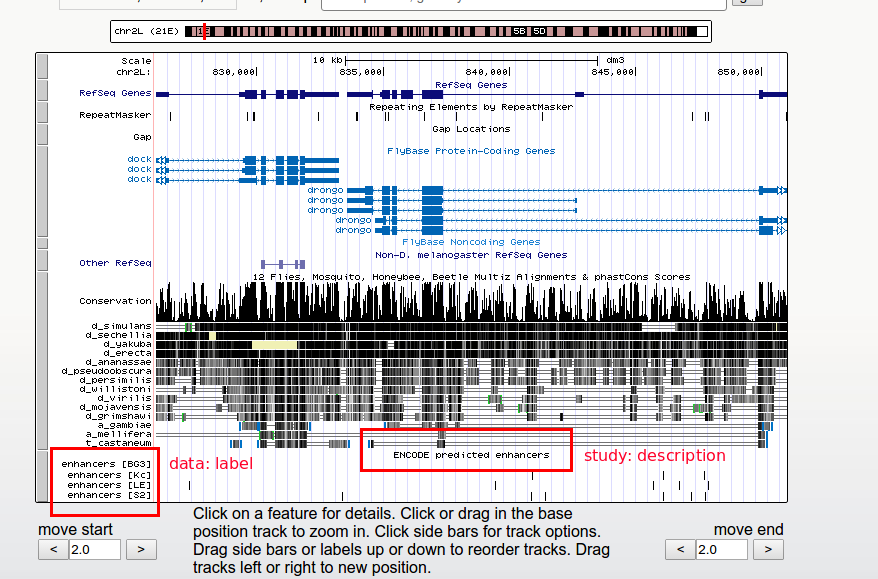

.. hubward documentation master file, created by
   sphinx-quickstart on Tue Jul  9 22:26:36 2013.
   You can adapt this file completely to your liking, but it should at least
   contain the root `toctree` directive.

.. include:: README.rst

We will be creating a new track hub for ENCODE data. The "lab" will be `encode`
and the "study" will be `encode-enhancers`::

    hubward new encode encode-enhancers

This generates the following directory structure::

    encode
    └── encode-enhancers
        ├── metadata-builder.py
        ├── processed-data
        │   ├── bam
        │   ├── bed
        │   ├── bigbed
        │   └── bigwig
        ├── raw-data
        ├── README
        └── src
            ├── get-data.bash
            └── process.py

Downloading the raw data
------------------------
The goal for this stage is to acquire and pre-process raw data. Generally
"pre-process" simply means uncompressing downloaded files -- anything
complicated will be handled later.

It's generally easier to download the raw data once. The
:file:`src/get-data.bash` script is a convenient way of storing this
information in a uniform place across all studies.

The template :file:`src/get-data.bash` looks like this:

.. literalinclude:: ../encode/encode-enhancers/src/get-data.bash
    :language: bash
    :caption: ``get-data.bash`` (template)

The ENCODE enhancer data appear to be all contained in a single `.tar.gz` file.
Here we edit the :file:`get-data.bash` script to download the data from the
correct URL, unzip the data in the `raw-data` directory, and clean up the
tarball afterwards:

.. literalinclude:: ../example/encode/encode-enhancers/src/get-data.bash
    :language: bash
    :caption: ``get-data.bash`` (edited version)

Upon running this script, we get the following directory structure::

    encode/encode-enhancers/raw-data/
    ├── CBP_enhancers_wormEE.txt
    ├── CBP_enhancers_wormL3.txt
    ├── DHS_enhancers_BG3.txt
    ├── DHS_enhancers_Gm12878.txt
    ├── DHS_enhancers_H1.txt
    ├── DHS_enhancers_Hela.txt
    ├── DHS_enhancers_IMR90.txt
    ├── DHS_enhancers_K562.txt
    ├── DHS_enhancers_Kc.txt
    ├── DHS_enhancers_LE.txt
    ├── DHS_enhancers_S2.txt
    ├── p300_enhancers_Gm12878.txt
    ├── p300_enhancers_H1.txt
    ├── p300_enhancers_HeLa.txt
    ├── p300_enhancers_K562.txt
    └── README.txt

The first few lines of :file:`DHS_enhancers_BG3.txt` are the following:

::

    chr pos
    chr2L 5800
    chr2L 134775
    chr2L 136385
    chr2L 220595
    chr2L 224480
    chr2L 225110
    chr2L 246950
    chr2L 247580
    chr2L 380020

So these are single-bp positions.

Our goal is to write a script that accepts a file like this and creates
a bigBed file that will be uploaded. After writing such a script, we will map
the input files to output files along with the script to do the work.

Editing the :file:`process.py` script
-------------------------------------
The script to map input (here, text files of single-bp positions) to output
(here, we want bigBed files) can be any language. It just has to accept
2 arguments: input file and output file. It can also live anywhere. For
convenience and provenance, we store the script in the `src` directory:

.. literalinclude:: ../example/encode/encode-enhancers/src/process.py

Equivalently, we could write a bash script to do the same thing:

.. literalinclude:: ../example/encode/encode-enhancers/src/process.sh
    :language: bash

.. note::

    The astute reader will have realized we hard-coded the dm3 genome, but
    there are raw data files for human and worm as well. For simplicity, in
    this example we're only working with *Drosophila melanogaster* data.

``metadata.yaml``
-----------------
The `metadata.yaml` file contains two main sections. The first, `study`,
contains bibliographic information about the dataset. The second, `data`, is
a list of configuration blocks. Each block configures the process of converting
input data to an output file and represents one track in the track hub.

``study`` section
~~~~~~~~~~~~~~~~~
An example should help clarify. Here's what we're aiming for for the `study`
section::

    study:
      PMID: 25164756
      description: 'ENCODE predicted enhancers'
      label: encode-enhancers
      processing: |
        Data were downloaded from https://www.encodeproject.org/comparative/chromatin
        as text files with chromosome and position.  BED3 files were created by
        extending the position by 1 bp, and BED3 files were converted to bigBed format.

        From the site::

            Enhancers were identified using TSS-distal DHSs and p300 and CBP-1 binding
            sites. The positions listed in the files are a subset of TSS-distal DHSs
            (human, fly), p300 (human) and CBP-1 (worm) binding sites that are
            classified as enhancers...  ...The classification was optimized to obtain
            a high confidence set that is not necessarily very inclusive. For
            additional information please see the README file in the archive.

      reference: 'Ho, J. W. K. et al. Comparative analysis of metazoan chromatin organization. Nature 512, 449-452 (2014).'

Field descriptions
++++++++++++++++++

:PMID:
    If provided, a link to the corresponding PubMed entry will be created in
    the track hub documentation.

:description:
    This is the track description, and will show up as the blue link text in
    the genome browser.

:label:
    This label is used internally for creating the track hub

:processing:
    Documentation of how the data were processed for uploading to UCSC. As
    we'll see in the example below, typically this information is written in
    the README file, which is then copied into this `processing` entry.

    Note that the README file can be in reStructuredText format (.rst), which
    will be converted to HTML upon uploading.

:reference:
    The full reference to where the data came from.

``data`` section
~~~~~~~~~~~~~~~~
Here's one entry from the ``data`` section::

    data:
      - description: 'BG3 enhancers'
        genome: dm3
        label: 'enhancers [BG3]'
        original: raw-data/DHS_enhancers_BG3.txt
        processed: processed-data/DHS_enhancers_BG3.bigbed
        script: src/process.py
        trackinfo:
          tracktype: 'bigBed 3'
          visibility: dense
        type: bigbed
        url: 'url to supplemental data'

.. _datafields:

`data` field descriptions
+++++++++++++++++++++++++
:description:
    This will show up in the "description" column on the track config page

:genome:
    Assembly to use

:label:
    This will show up on the left-hand side of tracks in the browser

:original:
    The path, relative to ``metadata.yaml``, containing the original data for
    this track

:processed:
    The path, relative to ``metadata.yaml``, for the final processed file ready
    for upload to UCSC

:script:
    The path, relative to ``metadata.yaml``, for the script that takes
    `original` as the first argument and `processed` as the second argument.

:trackinfo:
    Optional configuration items. These are converted to keyword arguments and
    sent to `trackhub <https://github.com/daler/trackhub>`_ for track hub
    creation.

:type:
    One of the types supported by UCSC track hubs (bigBed, bigWig, BAM, VCF)

:url:
    Optional URL to data. Typically this is the url used in the
    ``get-data.bash`` script.

Screenshots showing effect of config options
~~~~~~~~~~~~~~~~~~~~~~~~~~~~~~~~~~~~~~~~~~~~

With this information, the uploaded hub will look like this on the main browser
page:

Upon clicking the "ENCODE predicted enhancers" link, the following config page
will be seen:

Setting all tracks to "dense" will show the data in the browser:

Editing the ``metadata-builder.py`` script
------------------------------------------
In practice, editing the :file:`metadata.yaml` file by hand is tedious and
error-prone. Therefore, we use the :file:`metadata-builder.py` script to
generate it for us.

The script is shown below; the commented number (e.g., ``# [1]``) refers to
notes below.

.. literalinclude:: ../example/encode/encode-enhancers/metadata-builder.py
    :linenos:

Script annotations
~~~~~~~~~~~~~~~~~~

:``[1]``:
    These imports are done in the metadata-builder.py template that is created
    with the ``hubward new`` command; it's best to leave them.

:``[2]``:
    An ordered dictionary keeps the created `metadata.yaml` file a little more
    readable. Also note that we create an empty `study` dict and an empty
    `data` list that we'll fill in next

:``[3]``:
    The metadata-builder.py template has placeholders for these items; here the
    details about this particular study have been added.

:``[4]``:
    This line is unchanged from the metadata-builder.py template; it reads in
    the README file and uses it verbatim for the `processing` field. Note that
    the README file can be written in reStructuredText format, which will in
    turn get nicely formatted into HTML in the track config page.

:``[5]``:
    Here we iterate over the cell types of interest. Note that even though we
    have data for human and worm, we're only using the *Drosophila* cell lines.

:``[6]``:
    The remaining information is filled in as appropriate for each cell type.

:``[7]``:
    The final dictionary, ``d``, is written out to file.

Contents:

.. toctree::
   :maxdepth: 2

   readme
   installation
   usage
   contributing
   authors
   history

Indices and tables
==================

* :ref:`genindex`
* :ref:`modindex`
* :ref:`search`

